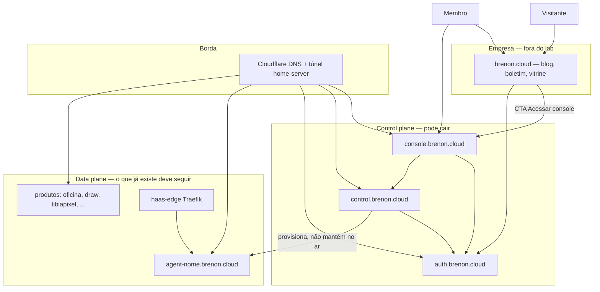
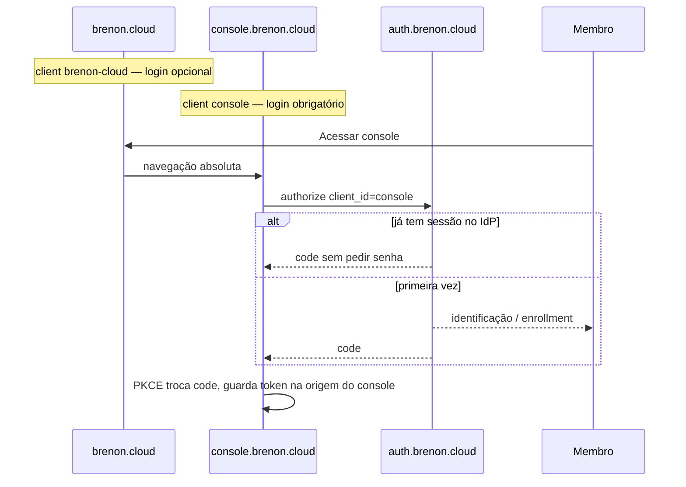
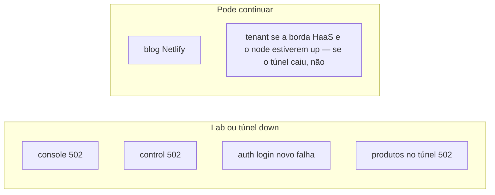
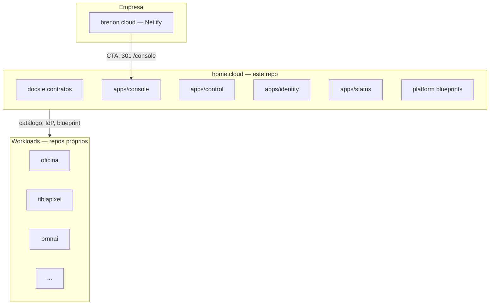

# ARCHITECTURE.md — como as peças se encaixam

Contrato técnico da landing zone. Comportamento está em [SPEC.md](./SPEC.md). Invariantes em [FOUNDATIONS.md](./FOUNDATIONS.md).

**Nada disto está implementado neste repositório ainda.** O lab Brenon já opera várias destas peças em outros repos; este documento é o alvo consciente.

---

## 1. Vista única



Leitura: o membro *entra* pelo console (control). O membro *usa* o tenant/produto (data). O visitante *lê* o site (empresa), que nem passa pelo lab.

---

## 2. Hostnames

| Host | Papel | Onde roda **agora** (alvo) | Depois |
|------|--------|----------------------------|--------|
| `brenon.cloud` | Empresa | Netlify | Netlify |
| `console.brenon.cloud` | Console membro | Swarm + túnel (rito oficina) | Front estático no Cloudflare; API continua no lab |
| `console.brnn.cloud` | Alias | quando a zona existir | mesmo app |
| `brnn.cloud` | Marca de produto | DNS + landing ou 302 | landing |
| `auth.brenon.cloud` | IdP | Swarm (já) | Swarm |
| `control.brenon.cloud` | Catálogo, billing glue, HaaS API | Swarm (já) | Swarm |
| `api.brenon.cloud` | Kong, máquina a máquina | Swarm (já) | Swarm |
| `uptime` / status | Saúde | já | alimenta `apps/status` |
| `agent-*`, `draw.`, `oficina.`, … | Data plane / produto | como hoje | como hoje |

Corte de URL no site (Netlify, não o app console):

```
/console          → 301 https://console.brenon.cloud/
/console/:splat   → 301 https://console.brenon.cloud/:splat
```

Rotas **dentro** do app console não usam prefixo `/console`. Apex `/` é o overview.

---

## 3. Identidade

Dois clients OIDC, **um** IdP. Tokens da SPA **não** se compartilham entre origens. SSO = cookie do IdP.



Logout do console: `post_logout_redirect_uri = https://brenon.cloud/`. Nunca um shell vazio.

Enrollment: aterrissa no console (é o produto que o membro acabou de pedir).

Não há proxy OAuth na frente do site nem do console SPA.

---

## 4. Blast radius (por que o console no lab é aceitável)



Dois incidentes diferentes, dois avisos diferentes:

| Falha | O que o membro vê | Nome honesto |
|-------|-------------------|--------------|
| Só a replica do console | 502 em `console.` ; `agent-alice` 200 | Console / control plane UI |
| Túnel | Tudo `*.brenon.cloud` do lab | Borda da plataforma |
| Só Oficina | oficina 502; console e Draw ok | Produto |

Até existir `apps/status` no Cloudflare, 502 cru do túnel é o contrato. Não é bug escondido.

---

## 5. Monorepo vs outros repos



Twelve-factor “1 repo = 1 app” vale para **workload**. A landing zone é o analog de Control Tower: vários *deployables* da fundação, um ciclo de docs.

---

## 6. Deploy do console (fase de implementação — não agora)

Rito já usado em oficina / tibiapixel / brnnai:

1. SPA build → imagem nginx (`platform/spa-nginx`).
2. Stack Swarm, porta publicada no manager ou node combinado.
3. Túnel: hostname explícito **acima** de qualquer ingress `*.brenon.cloud` do HaaS.
4. CNAME `console` → UUID do túnel, proxied.
5. Smoke **público** `https://console.brenon.cloud/`, não só LAN.

Depois (roadmap): o HTML do console vai para Cloudflare Pages/Worker. O lab continua sendo origem das APIs. Worker serve `apps/status` se o origin morrer.

---

## 7. Dependências que ainda apontam para `brenon.cloud/console`

Inventário para o cutover (código hoje noutros repos):

- Stripe success / cancel / portal return
- E-mail de boas-vindas
- `GATE_URL` da home HaaS e footer da página do membro
- Skills do tenant que citam o console
- Menu do site (`router-link` interno)

O 301 no Netlify cobre bookmark. Esta lista **não** passa pelo browser na origem do blog.

CORS do control plane hoje ecoa `https://brenon.cloud`. Precisa ecoar `https://console.brenon.cloud` antes do cutover.

---

## 8. Decisões de desenho (ADR-lite)

### D1 — Console no lab agora, Cloudflare depois

**Contexto:** o shell precisa nascer. Netlify seria outra blast radius (boa), mas foge do rito dos apps da casa e atrasa o “é um produto da plataforma”.  
**Decisão:** Swarm + túnel no dia 1. CF no front é fase explícita.  
**Reverter quando:** o 502 do lab no console doer mais que o custo de Pages/Worker.

### D2 — Dois clients OIDC

**Contexto:** um client com dois redirects mistura lifetime de token do blog com o do console.  
**Decisão:** `brenon-cloud` no site, `console` no console. SSO pelo IdP.  
**Reverter quando:** nunca, a menos que o site deixe de reconhecer membro.

### D3 — Blog fora do lab

**Contexto:** REL11 — data plane da *empresa* não deve cair com o Swarm.  
**Decisão:** Netlify permanece.  
**Reverter quando:** nunca por capricho de monorepo.

### D4 — Workloads fora deste git

**Contexto:** multi-account. Oficina não é fundação.  
**Decisão:** este repo recusa PRs de produto.  
**Reverter quando:** um utilitário *da plataforma* (oauth2-proxy pattern) — aí vai em `platform/`, não em `apps/oficina`.

### D5 — Sem wildcard DNS de zona

**Contexto:** já é fato da zona.  
**Decisão:** um CNAME por tenant. Ingress de túnel pode ter `*.brenon.cloud` para Traefik, mas DNS não.  
**Reverter quando:** a zona ganhar wildcard de propósito, com o HaaS e o console explícitos ainda ganhando.

---

## 9. O que avaliar antes de implementar

Checklist de estudo (é para isso que este repo existe agora):

- [ ] Concorda que o console é control plane e **pode** 502?
- [ ] Concorda que tenant já criado é data plane?
- [ ] Concorda que o blog não entra neste git nem neste Swarm?
- [ ] Concorda que oficina não entra neste git?
- [ ] Concorda com dois clients OIDC?
- [ ] Concorda com console no lab agora, Cloudflare depois — não o contrário?
- [ ] A taxonomia de [docs/taxonomy.md](./docs/taxonomy.md) lista o que você chamaria de plataforma?

Se algum item for não, muda o documento **antes** de extrair Vue.
