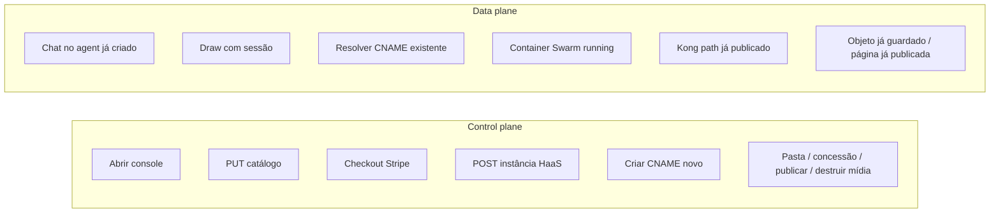
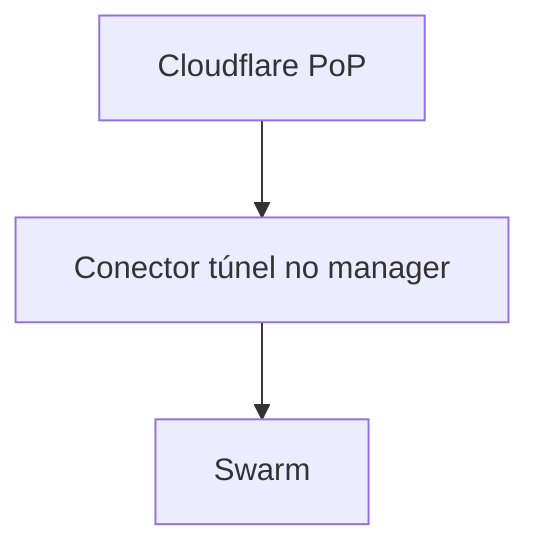

# Control plane vs data plane

Leitura curta do que [FOUNDATIONS.md](../FOUNDATIONS.md) cita nos papers. Aplicado a este lab.

## Definição

| | Control plane | Data plane |
|---|---------------|------------|
| Faz | Criar, alterar, apagar, listar | A função do recurso já existente |
| Complexidade | Alta (orquestração, vários sistemas) | De propósito baixa |
| Meta de disponibilidade | Menor | Maior |
| Na falha | “Não consigo criar/mudar” | “O que já existia parou” — isto é o incidente grave |

AWS: lançar EC2 é control; a instância já rodando encaminhar pacote é data. Route 53: mudar policy é control; responder query é data.

## Mapa Brenon

## Estabilidade estática aqui

Experimento que a fundação **exige** depois que o console existir:

1. Tenant `agent-alice` responde saúde.
2. Parar a replica do console (e só ela).
3. `agent-alice` ainda responde saúde e chat.
4. Criar um tenant novo **pode** falhar — esperado.
5. O mesmo para um tenant de mídia já existente: objeto já guardado e página já publicada respondem. Criar pasta, alterar concessão, publicar ou destruir **pode** falhar.

Se o passo 3 (ou 5) falhar, o tenant dependia do console em runtime. Isso é bug de desenho, não “o lab é frágil”.

## O que não fazer na recuperação

- Abrir Portainer para *lançar* capacidade nova como primeiro passo do incidente.
- Chamar a API de provision no meio da queda para “recuperar” o que já existia.
- Recriar o tenant de mídia para “salvar” o acervo que já existia.
- Tratar 502 do console como 502 do produto.
- Tratar 502 do produto de mídia como “a plataforma caiu”.

Fazer: saúde do data plane (túnel, Traefik, task running). Página de downtime futura lê isso, não o console.

## IdP

Authentik mistura os dois, como o IAM da AWS:

- **Control:** admin, criar app, mudar grupo.
- **Data:** emitir/validar token, authorize de quem já tem sessão.

IdP down: logins novos falham em tudo (plataforma). Sessões já emitidas podem seguir. Não chame isso de “Oficina caiu” se a Oficina só recusou um login novo.

## Borda

O túnel é data plane de *quase toda* a casa no lab. É o SPOF honesto.

Queda do conector ≠ queda do console. O aviso deve dizer **borda**. O blog Netlify, fora deste grafo, é o contraste útil: empresa viva, lab morto.

## REL11-BP04 em uma frase

> No incidente, use o que já está provisionado. Não use a API que cria coisa.
