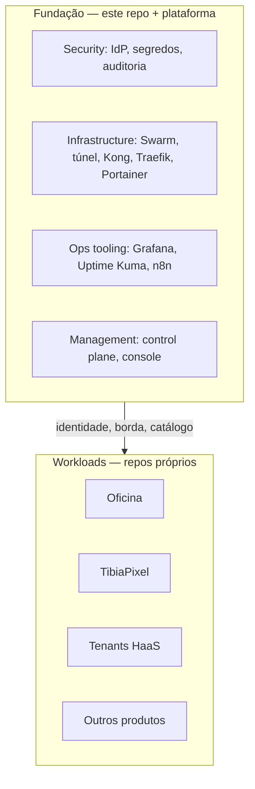

# Landing zone — Organizations em um lab

AWS: várias **contas**, agrupadas em **OUs**, com uma conta de management que não roda workload.

Lab: não há contas AWS. A fronteira é hostname + stack + grupo de identidade + repositório.

## OUs fundacionais vs workload

A conta de management da AWS **não** hospeda a loja. Aqui: `control` e `console` não hospedam Oficina.

## Mapeamento

| AWS | Lab |
|-----|-----|
| Organization | A casa (`brenon.cloud` como zona + este git) |
| Management account | `control` + quem aplica identidade. Acesso estreito (`brenon-admins`) |
| Security OU | Authentik, tokens em `~/.hermes/secrets`, não no git |
| Infrastructure OU | Swarm, túnel, Kong, haas-edge |
| Shared services | Grafana, MinIO, n8n |
| Workload account | Um produto = um repo + uma stack + um hostname |
| SCP / guardrail | Grupos Authentik deny-by-default; catálogo sem tile inventado na SPA |
| Service Catalog | `GET /api/v1/catalog` |
| Control Tower blueprint | [add-a-service.md](./add-a-service.md) |

## Por que workloads não entram neste git

Isolamento de falha humana: um PR de Oficina não pode quebrar o IdP. Isolamento de release: tag de produto ≠ tag da fundação. Isolamento de história: o clone didático não leva o ERP de oficina.

Utilitário *da plataforma* (Dockerfile SPA nginx, snippet oauth2-proxy) mora em `platform/`.

## Novo “account” na prática

Nascer um produto é:

1. Repo próprio.
2. Imagem versionada.
3. Stack no Swarm com rede/alias combinados.
4. Hostname no túnel + CNAME (um registro).
5. App no IdP se houver humanos.
6. Registro no catálogo se o console deve mostrar.

Isto é o blueprint. Não é “adicionar pasta em `apps/`”.

## Console Air, Draw, HaaS

| Coisa | OU mental |
|-------|-----------|
| Draw | Workload (produto da casa, SSO qualquer conta) |
| Console Air | Workload |
| Grafana | Fundação / shared |
| Tenant `agent-x` | Workload; o *provisioner* é management |
| Console membro | Management / control plane UI |

Draw “parece plataforma” porque qualquer membro entra. Continua produto: se Draw cair, a nuvem não caiu.
