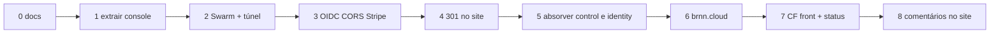

# Roadmap

Ordem para **quando** a leitura dos contratos estiver alinhada. Este repo está na **Fase 0**.

## Fase 0 — agora

Este git. SPEC, FOUNDATIONS, ARCHITECTURE, taxonomia. Sem código de app.

**Saída:** concordância humana nos checklists de [ARCHITECTURE.md](../ARCHITECTURE.md) §9.

## Fase 1 — extrair `apps/console`

Copiar o Vue de console do repo do site. Router sem prefixo `/console`. Testes do console passam. Sem DNS.

## Fase 2 — lab, rito oficina

Imagem nginx, stack, túnel, CNAME `console`. Smoke público 200.

## Fase 3 — ligar o cérebro

Client OIDC `console`. CORS Origin do console no control. Stripe return, e-mail, `GATE_URL`. ForceUpdate do control **sem** colar compose git com senha mascarada.

## Fase 4 — o membro muda de URL

301 `/console/*` no Netlify do site. Menu vira link absoluto. Bundle do site perde o shell.

## Fase 5 — um git de fundação de verdade

Mover control e identity para `apps/`. Redigir secrets. Remote público só depois do scan.

## Fase 6 — marca

Zona `brnn.cloud`. Alias `console.brnn.cloud`. Apex landing ou 302. Não mover `auth` / `control` / `agent-*`.

## Fase 7 — static stability do shell

Pages/Worker. `apps/status`. Distinguir plataforma vs produto vs borda. Até aqui, 502 do lab no console é esperado.

## Fase 8 — experimento no site

Comentários etc. Identidade do **site**. Fora da fundação operacional.

## Não fazer no mesmo GO

- Redesign do console.
- Trazer Oficina para este repo.
- `--wave 9` no IdP.
- Wildcard DNS de zona.
- Prometer que o console não cai.

## Critério “chegamos”

Lista em [SPEC.md](../SPEC.md) §8 e [ARCHITECTURE.md](../ARCHITECTURE.md) — mais o experimento: console parado, tenant vivo.
