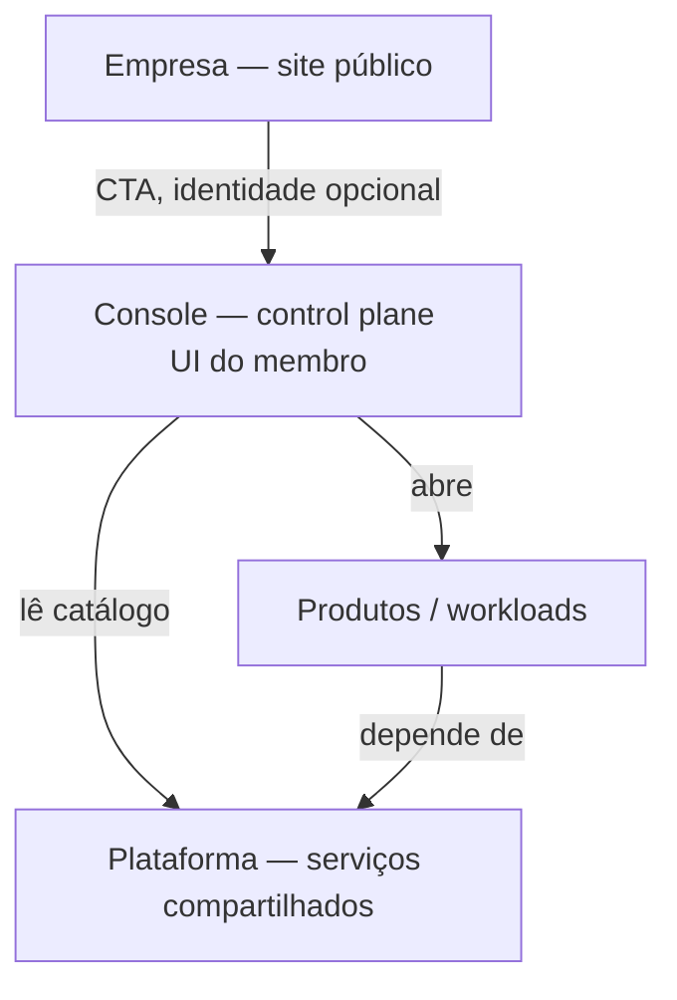

# Taxonomia — empresa, plataforma, produto, console

Se a página de downtime mentir, é porque esta tabela falhou.

## Vista

## Empresa

Superfície da pessoa/marca. Login opcional. **Não** é serviço da plataforma.

| Superfície | Host alvo | Se cair |
|------------|-----------|---------|
| Blog, boletim, vitrine, jogos, trilha | `brenon.cloud` | Some a conversa pública. Plataforma e produtos **não** dependem disto. |

## Plataforma

O que outros workloads assumem. Dono: operação da casa. Guardrail: grupos de staff, não plano pago.

| Função | Host / peça | Plano AWS (analog) | Se cair |
|--------|-------------|--------------------|---------|
| Identidade | `auth.brenon.cloud` | IAM | Login **novo** falha. JWT já emitido pode seguir até expirar. |
| Catálogo, billing glue, provision | `control.brenon.cloud` | Control Tower + Service Catalog | Não cria tenant, não Checkout. Tenants já criados seguem. |
| Console membro | `console.brenon.cloud` | console.aws.amazon.com | Membro não opera. Data plane segue. |
| Orquestração | Swarm + Portainer | EC2/ECS control | Não faz deploy novo. Task running segue até o node morrer. |
| Borda lab | Túnel `home-server` + CNAMEs | Route 53 data + edge | Some `*.brenon.cloud` do lab. Site da empresa não. |
| API máquina | `api.brenon.cloud` Kong | API Gateway | Paths key-auth. Não é o console. |
| Edge HaaS | Traefik haas-edge | data plane de roteamento de tenant | Tenant some se *este* cair. |
| Observabilidade | Grafana, Uptime Kuma | CloudWatch | Cego. Não derruba produto. |
| Object storage | MinIO | S3 | Objetos: data. Console MinIO: control. |
| Automação | n8n | Step Functions frouxo | Jobs param. |

**Regra:** aviso “a plataforma caiu” só cita linhas desta tabela.

## Produto / workload

Isolado. Repo próprio. Pode morrer sozinho.

Exemplos vivos no lab Brenon: OficinaCloud, TibiaPixel, BRNN AI, VServer, Draw, Console Air, Profitt, Clinicsy, Atalaia, Mentoria, tenants `agent-{nome}.brenon.cloud`.

Criar/apagar tenant = control plane. Usar tenant já criado = data plane.

## Console

É **plataforma** (control plane UI). Não é produto. Não é empresa.

O membro *vê* produtos através dele. Se o console 502 e o Draw abre, a taxonomia está certa.

**Shell único, dois hosts:** `console.brenon.cloud` (porta do membro) e `control.brenon.cloud` (catálogo / billing / provision + UI staff). Mesmo idioma visual. Staff ≠ cliente. Control down ≠ data plane down.

## Marca

`brnn.cloud` — linha de produto (aws.amazon.com). Não substitui `brenon.cloud`. Não entra na tabela de plataforma até hospedar um serviço de plataforma de verdade (hoje: alias do console, landing).

## Teste rápido

> Oficina fora do ar. Console e Draw ok.  
> Texto errado: “Brenon Cloud está down.”  
> Texto certo: “OficinaCloud está indisponível.”

> Túnel morto. Blog Netlify ok. Console 502. Agent 502.  
> Texto certo: “Borda da plataforma indisponível.” Não: “só o console.”
